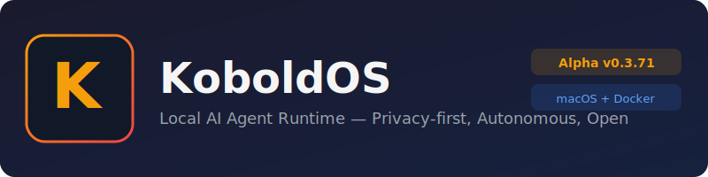

<p align="center">
  
</p>

<p align="center">
  
  
  
  
  
</p>

<p align="center">
  <strong>Dein eigener KI-Agent. Lokal. Privat. Autonom.</strong><br>
  Keine Cloud. Keine Abos. Keine Datensammlung. Alles auf deinem Rechner.
</p>

---

> **Alpha-Software** — KoboldOS ist ein privates Hobbyprojekt in aktiver Entwicklung. Features können sich jederzeit ändern, es können Bugs auftreten, und nicht alles funktioniert perfekt. Nutze KoboldOS zum Testen und Experimentieren. **Keine Haftung, keine Garantie, keine Gewährleistung. Nutzung auf eigene Verantwortung.**

---

## Was ist KoboldOS?

KoboldOS ist ein **vollautonomes KI-Agent-System**, das komplett lokal auf deinem Rechner läuft. Kein einfacher Chatbot — ein Agent, der selbstständig Tools nutzt, plant, handelt und sich erinnert.

Ein lokales Ollama-Sprachmodell wird mit **55+ Tools**, persistentem Gedächtnis, Aufgabenplanung, Spracheingabe und Agent-zu-Agent Kommunikation verbunden.

### Warum KoboldOS?

| Vorteil | Beschreibung |
|---------|-------------|
| **100% Lokal** | Dein LLM und alle Daten bleiben auf deinem PC. Nichts geht in die Cloud. |
| **Kein Abo** | Keine monatlichen Kosten, keine API-Keys nötig, keine Limits. |
| **Echter Agent** | Autonome Tool-Nutzung, mehrstufiges Reasoning, Sub-Agenten. |
| **55+ Tools** | Shell, Browser, GitHub, Telegram, Google, Docker, E-Mail, und mehr. |
| **Gedächtnis** | 3-Tier Memory mit Vektorsuche. Erinnert sich, lernt, wächst. |
| **Multi-Plattform** | Native macOS-App + Docker-Container (Windows, macOS, Linux). |

---

## Installation

### macOS (Native App)

```bash
# 1. Ollama installieren
brew install ollama && ollama serve

# 2. KoboldOS bauen
git clone https://github.com/FunkJood/KoboldOS.git
cd KoboldOS && bash scripts/build.sh
# Erstellt ~/Desktop/KoboldOS-0.3.71.dmg
```

Oder: DMG öffnen, in Programme ziehen, starten.

### Docker (Windows / macOS / Linux)

```bash
# 1. Ollama installieren: https://ollama.com/download

# 2. docker-compose.yml herunterladen
curl -O https://raw.githubusercontent.com/FunkJood/KoboldOS-Docker/main/docker-compose.yml

# 3. Starten
docker compose up -d

# 4. WebGUI: http://localhost:9090 (admin / admin)
```

> [Ausführliche Docker-Anleitung →](https://github.com/FunkJood/KoboldOS-Docker)

---

## Features

### Agent-System

- **Autonomer Agent-Loop**: Anfrage → Reasoning → Tool-Wahl → Ausführung → Ergebnis → nächster Schritt
- **3 Agent-Typen**: General (Orchestrator), Coder (Programmierung), Web (Recherche)
- **Sub-Agenten**: Aufgaben an spezialisierte Agenten delegieren
- **Parallele Delegation**: Mehrere Agenten gleichzeitig arbeiten lassen
- **Skills**: Markdown-basierte Fähigkeiten, dynamisch erweiterbar

### 55+ Built-in Tools

<details>
<summary><strong>Alle Tools anzeigen</strong></summary>

| Kategorie | Tools |
|-----------|-------|
| **Kommunikation** | Telegram (Text/Dateien/Fotos/Audio/Voice), WhatsApp Business, Slack, E-Mail (SMTP/IMAP), Twilio SMS, Twilio Voice Calls |
| **APIs & Services** | GitHub, Google (YouTube Upload/Drive/Gmail/Calendar/Maps), Microsoft 365 (OneDrive/Outlook/Teams), Notion, Reddit, SoundCloud (Upload), Suno AI (Musik), ElevenLabs (TTS), HuggingFace, Uber |
| **Web & Browser** | Web-Suche, HTTP-Requests, RSS-Feeds, Playwright (Chrome: Navigate, Click, Fill, Screenshot, JS, OCR) |
| **System (macOS)** | Shell (zsh), Dateien, AppleScript, Screen Control (Maus/Tastatur/OCR), Kalender, Kontakte |
| **System (Docker)** | Shell (bash), Dateien, Docker CLI (Container verwalten), sudo apt-get |
| **KI & Medien** | TTS (System + ElevenLabs), STT (Whisper), Bildgenerierung (ComfyUI/SDXL), Vision |
| **Infrastruktur** | Cloudflare Tunnel, MQTT (IoT/Smart Home), Webhooks, CalDAV |
| **Organisation** | Cron-Tasks, Workflows (visueller Editor), Checklisten |
| **Gedächtnis** | Kurzzeit/Langzeit/Wissen, Vektorsuche, Archiv, Snapshots, Rollback |
| **Meta** | Sub-Agent Delegation, Parallele Tasks, Skill-Erstellung, Self-Awareness |

</details>

### Gedächtnis & Bewusstsein

| Feature | Beschreibung |
|---------|-------------|
| **3-Tier Memory** | Kurzzeit, Langzeit, Wissen — mit semantischer Vektorsuche |
| **Consciousness Engine** | LIDA-Kognitionszyklus (Wahrnehmung → Aufmerksamkeit → Aktion → Reflexion) |
| **Emotionaler Zustand** | Valence/Arousal beeinflusst Agent-Verhalten |
| **Versionierung** | Snapshots, Diffs, Rollback — Gedächtnis ist versioniert |

### 14 Integrationen

Alle direkt in der App / WebGUI konfigurierbar:

| Dienst | Fähigkeiten |
|--------|-------------|
| **Telegram** | Bot: Text, Dateien, Fotos, Audio, Voice-Messages (mit STT) |
| **Google** | YouTube Upload, Drive, Gmail, Calendar, Maps |
| **GitHub** | Repos, Issues, PRs, Code-Suche |
| **Microsoft** | OneDrive, Outlook, Calendar, Teams |
| **Slack** | Channels, Nachrichten |
| **Notion** | Seiten, Datenbanken |
| **SoundCloud** | Track-Upload, Playlists |
| **Reddit** | Posts, Kommentare, Subreddits |
| **Suno AI** | Musikgenerierung per Prompt |
| **ElevenLabs** | Text-to-Speech, Voice-Cloning |
| **WhatsApp** | Business API |
| **Twilio** | SMS, Voice Calls |
| **Cloudflare** | HTTPS-Tunnel für Remote-Zugriff |
| **MQTT** | IoT/Smart-Home |

### A2A (Agent-to-Agent)

KoboldOS-Instanzen kommunizieren miteinander — macOS-App steuert Docker-Agent, mehrere Container arbeiten zusammen:

- **JSON-RPC 2.0** nach Google A2A Standard
- **Agent Discovery** via `/.well-known/agent.json`
- **Token-Auth** mit granularen Berechtigungen (7 Ressourcen x Read/Write)
- **SSE-Streaming** für Echtzeit-Antworten
- **Persistente Agent-ID** (UUID)

### Aufgaben & Automatisierung

- **Cron-Scheduler**: Stündlich, täglich, wöchentlich, monatlich, ...
- **Idle-Tasks**: Agent arbeitet automatisch in Leerlaufzeiten
- **Proaktive Engine**: Heartbeat, Ziele, System-Health-Alerts
- **Workflow-Editor**: Visuelle Nodes, Connections, Trigger

---

## Plattform-Vergleich

| Feature | macOS App | Docker |
|---------|-----------|--------|
| **Interface** | SwiftUI (nativ) | WebGUI (Browser) |
| **Screen Control** | Maus/Tastatur/OCR | — |
| **Bildgenerierung** | ComfyUI (SDXL) | — |
| **Spracheingabe** | Whisper (STT) | — |
| **AppleScript** | Safari, Mail, etc. | — |
| **Kalender/Kontakte** | Apple nativ | CalDAV |
| **Teams** | Multi-Agent Diskurs | — |
| **Marktplatz** | Widgets, Skills | — |
| **Docker-Steuerung** | — | Container verwalten |
| **Tresor** | Keychain | WebGUI Vault |
| **Windows/Linux** | — | Vollständig |
| **Integrationen** | OAuth + WebGUI | WebGUI |
| **A2A** | Server + Client | Server + Client |
| **Remote-Zugriff** | WebGUI + Tunnel | Port 9090 |

---

## Architektur

```
┌─────────────────────────────────────────────────────────┐
│       macOS: SwiftUI App  |  Docker: WebGUI (HTML/JS)   │
│  Chat  Aufgaben  Teams    |  Chat  Aufgaben  Settings   │
└──────────────────────┬──────────────────────────────────┘
                       │ HTTP (REST + SSE)
┌──────────────────────▼──────────────────────────────────┐
│              DaemonListener (TCP HTTP Server)           │
│  /agent/stream  /memory  /settings  /a2a  /health       │
└──────────────────────┬──────────────────────────────────┘
                       │
┌──────────────────────▼──────────────────────────────────┐
│                    AgentLoop (Swift Actor)              │
│  System-Prompt → Ollama → ToolCallParser → Ausführung   │
│  → Ergebnis → nächste Runde → bis "response"            │
└──────────────┬────────────────────────┬─────────────────┘
               │                        │
┌──────────────▼───────────┐   ┌────────▼────────────────┐
│    LLMRunner (Ollama)    │   │    ToolRegistry (55+)   │
│  /api/chat (Streaming)   │   │  Shell  File  Browser    │
│  Lokales Modell          │   │  Telegram  GitHub  ...   │
└──────────────────────────┘   └─────────────────────────┘
```

---

## API

<details>
<summary><strong>Alle Endpoints</strong></summary>

| Endpoint | Methode | Beschreibung |
|----------|---------|-------------|
| `/agent/stream` | POST | Chat mit SSE-Streaming (voller Agent-Loop) |
| `/health` | GET | Status, Version, Plattform |
| `/memory` | GET | CoreMemory Blöcke |
| `/memory/entries` | GET | Gedächtnis mit Filtern |
| `/memory/entries/search` | POST | Semantische Suche |
| `/memory/snapshot` | POST | Snapshot erstellen |
| `/memory/rollback` | POST | Auf Version zurücksetzen |
| `/settings` | GET/POST | Einstellungen |
| `/models` | GET | Ollama-Modelle |
| `/tasks` | GET/POST | Aufgaben |
| `/connections` | GET/POST | Integrationen |
| `/a2a` | POST | A2A JSON-RPC 2.0 |
| `/.well-known/agent.json` | GET | Agent Card |
| `/consciousness` | GET | Emotionaler Zustand |
| `/update/check` | GET | Update-Check |
| `/token` | GET/POST | API-Token |

</details>

---

## Entwicklung

```bash
# macOS App
swift build -c release
bash scripts/build.sh         # DMG erstellen

# Docker
cd ../KoboldOS-Docker
docker build -t koboldos .    # Image bauen

# Neues Tool
# 1. Sources/KoboldCore/Tools/MeinTool.swift (AgentTool Protocol)
# 2. In AgentLoop registrieren
# 3. Tool-Beschreibung erscheint automatisch im System-Prompt
```

---

## Bekannte Einschränkungen

- **Alpha-Software** — Bugs und unerwartetes Verhalten sind möglich
- Bildgenerierung braucht ~2 GB Modell-Download beim ersten Start
- Speech-to-Text braucht ~75–466 MB Whisper-Modell
- Vision nur mit multimodalen Modellen (llava, llama3.2-vision)
- Playwright braucht Chrome + `npm install -g playwright`
- Screen Control braucht macOS Accessibility-Berechtigung
- OAuth-Tokens können ablaufen — in Einstellungen neu verbinden

---

## Haftungsausschluss

KoboldOS ist ein **privates Hobbyprojekt** in der **Alpha-Phase**. Es wird "as-is" bereitgestellt, ohne jegliche Garantie oder Gewährleistung. Die Entwickler übernehmen **keine Haftung** für Schäden, Datenverlust oder sonstige Probleme durch die Nutzung von KoboldOS.

Durch die Nutzung akzeptierst du:
- KoboldOS kann Bugs enthalten und unerwartetes Verhalten zeigen
- Der Agent kann Shell-Befehle ausführen, die dein System verändern
- Du bist selbst für die Sicherheit deiner API-Keys und Tokens verantwortlich
- Kein Support oder SLA wird garantiert

**Nutze KoboldOS ausschließlich zu Test- und Experimentierzwecken.**

---

## Links

| | |
|---|---|
| **Docker** | [KoboldOS-Docker](https://github.com/FunkJood/KoboldOS-Docker) — Container für Windows/macOS/Linux |
| **Docker Hub** | [`docker pull funkjood/koboldos`](https://hub.docker.com/r/funkjood/koboldos) |
| **Ollama** | [ollama.com](https://ollama.com) — Lokales LLM-Backend |

---

<p align="center">
  <strong>KoboldOS</strong> — Local-first, Privacy-focused AI Agent Runtime<br>
  Made by <a href="https://soundcloud.com/funkjoodmusic">FunkJood</a>
</p>
